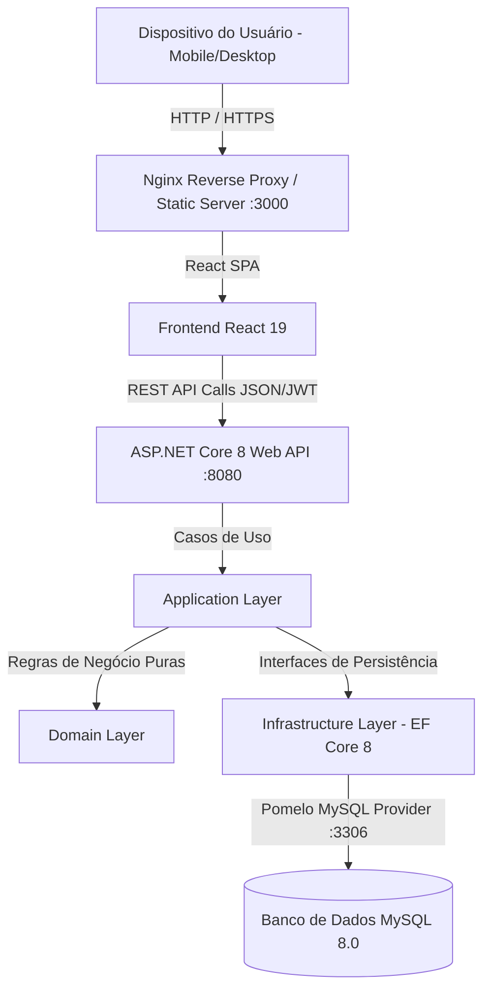
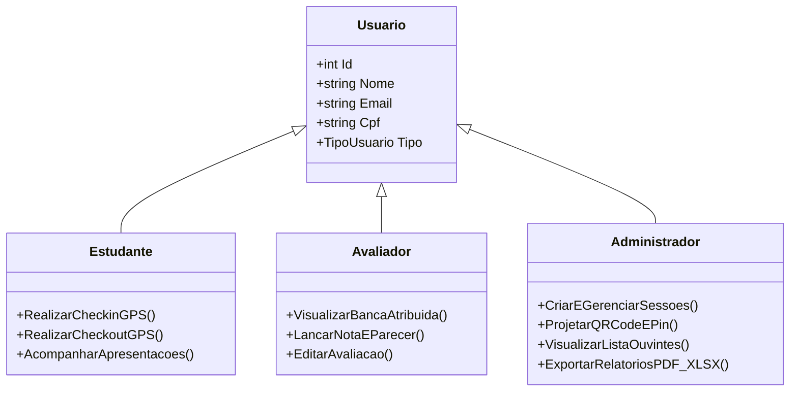

# SisEU — Documentação Técnica e Arquitetural do Sistema

> **Sistema Integrado de Gestão, Presença Geolocalizada e Avaliação dos Encontros Universitários da UFC**  
> *Versão:* 1.0.0 | *Ambiente:* Docker / .NET 8 / React 19 / MySQL 8

---

## 1. O que é o SisEU?

O **SisEU** é uma plataforma web responsiva (*Mobile-First*) desenvolvida para modernizar, automatizar e assegurar a integridade dos processos dos **Encontros Universitários da Universidade Federal do Ceará (UFC)** — um dos maiores eventos acadêmicos e de extensão do estado.

### 1.1. O Problema Real
Historicamente, grandes eventos universitários enfrentam gargalos críticos:
1. **Fraudes no Registro de Presença:** Assinaturas em listas de papel ou repasse de links/códigos para terceiros que não estão presentes no local.
2. **Morosidade na Atribuição de Notas:** Fichas de avaliação impressas geram extravios, erros de digitação e atrasos no cálculo de premiações acadêmicas.
3. **Complexidade Logística:** Dificuldade na apuração de horas complementares e consolidação de relatórios para os órgãos de fomento (CNPq, CAPES, UFC).
4. **Poluição Visual e Falta de Usabilidade:** Interfaces acadêmicas tradicionais não são adaptadas para o uso ágil em celulares durante o evento.

### 1.2. A Solução do SisEU
O SisEU digitaliza todo o ciclo de vida do evento:
* **Presença Anti-Fraude com Dupla Camada:** O registro exige que o aluno esteja fisicamente dentro do raio geográfico da sessão (cálculo geodésico via GPS) combinado a um **PIN/QR Code dinâmico** exibido no telão da sala.
* **Avaliação Digital Instantânea:** Professores e avaliadores acessam suas bancas no celular ou notebook e lançam notas e pareceres em tempo real.
* **Projeção para Auditórios:** Modo de exibição limpo para projetores com alternância entre Check-in (Entrada) e Check-out (Saída).
* **Exportação Multiformato (RF007):** Emissão instantânea de relatórios em PDF, Excel (XLSX), XML e JSON.

---

## 2. Arquitetura e Estrutura do Projeto

O sistema adota uma arquitetura em camadas baseada nos princípios do **Domain-Driven Design (DDD)** e **Clean Architecture (Onion Architecture)** no Backend, com uma Single Page Application (SPA) modular no Frontend.



### 2.1. Estrutura de Diretórios

```text
SisEU/
├── docker-compose.yml              # Orquestração dos 3 containers (MySQL, API, Front)
├── Readme.md                       # Apresentação do projeto
├── DOCUMENTACAO_TECNICA.md         # Esta documentação detalhada
│
├── back/                           # BACKEND (.NET 8 C#)
│   ├── SisEUs.sln                  # Solução Visual Studio / .NET CLI
│   ├── Dockerfile                  # Multi-stage build .NET SDK + ASP.NET Runtime
│   └── src/
│       ├── SisEUs.Domain/          # Entidades de Domínio, Enums, Value Objects e Interfaces
│       │   ├── ContextoDeAvaliacao/
│       │   ├── ContextoDeEvento/    # Entidade Evento/Sessão, Coordenadas, PINs
│       │   ├── ContextoDePresenca/  # Registro de Check-in/Check-out
│       │   └── ContextoDeUsuario/   # Entidade Usuário, Tipos e Permissões
│       │
│       ├── SisEUs.Apresentation/   # Application Layer: Casos de Uso, DTOs, Handlers
│       │
│       ├── SisEUs.Infrastructure/  # Persistência EF Core, Mapeamentos, Repositórios, BCrypt
│       │   └── Data/
│       │       └── ApplicationDbContext.cs
│       │
│       └── SisEUs.API/             # Controllers REST, Injeção de Dependências, JWT, Swagger
│           ├── Controllers/
│           │   ├── AutenticacaoController.cs
│           │   ├── AvaliacaoController.cs
│           │   ├── EventoController.cs
│           │   └── PresencaController.cs
│           └── Program.cs          # Pipeline de inicialização e middlewares
│
└── front/                          # FRONTEND (React 19 + Tailwind CSS)
    ├── package.json                # Dependências enxutas do projeto
    ├── Dockerfile                  # Multi-stage build Node.js + Nginx Alpine
    ├── nginx.conf                  # Roteamento SPA e proxy reverso
    ├── tailwind.config.js          # Paleta visual, Dark Mode e fontes
    └── src/
        ├── api/                    # Instância Axios com interceptors de JWT
        ├── components/             # Componentes reutilizáveis
        │   ├── layout/             # Header, Navbar, BottomNav mobile
        │   ├── sessions/           # SessionCard, SessionQRCodeModal, EvaluationModal
        │   └── ui/                 # Button, Modal, Card, Badge, Toast, Loading
        ├── context/                # AuthContext, ThemeContext, ToastContext
        ├── features/               # Módulos especializados (ex: criação de sessões)
        ├── hooks/                  # Custom hooks (useAuth, useToast, useSessoes)
        ├── pages/                  # Telas da aplicação (Login, Dashboard, Admin, etc.)
        ├── services/               # Serviços de comunicação HTTP com a API
        └── utils/                  # Formatadores, validadores, geodésia e geradores de PDF/Excel
```

---

## 3. Linguagens, Frameworks e Bibliotecas

| Camada | Tecnologia | Função no Sistema |
| :--- | :--- | :--- |
| **Linguagem Backend** | **C# 12 (.NET 8)** | Tipagem estática, alto desempenho e robustez nas regras de negócio. |
| **Framework Backend** | **ASP.NET Core Web API** | Exposição dos endpoints RESTful e injeção de dependências nativa. |
| **ORM / Banco** | **Entity Framework Core 8 + MySQL 8** | Mapeamento objeto-relacional com *Pomelo Provider*, migrations e integridade referencial. |
| **Autenticação** | **JWT (JSON Web Tokens) + BCrypt** | Sessões stateless, proteção contra ataques de força bruta e hash de senhas. |
| **Linguagem Frontend** | **JavaScript (ES6+) / JSX** | Renderização declarativa e interativa. |
| **Biblioteca SPA** | **React 19** | Gerenciamento de estado reativo e ciclo de vida otimizado. |
| **Estilização** | **Tailwind CSS 3** | CSS utilitário, design responsivo, safe areas mobile e Dark Mode nativo. |
| **Roteamento** | **React Router DOM 7** | Navegação cliente e proteção de rotas privadas por perfil. |
| **Documentos & Exportação** | **jsPDF + jspdf-autotable** | Geração e download direto de relatórios PDF binários em memória. |
| **Planilhas** | **SheetJS (xlsx)** | Geração de arquivos `.xlsx` estruturados no cliente. |
| **QR Code** | **react-qr-code + html5-qrcode** | Renderização vetorial SVG de QR Codes e leitura via câmera do smartphone. |
| **Ícones** | **React Icons (Feather Icons)** | Ícones consistentes, leves e com semântica visual limpa (substituindo emojis). |
| **Containerização** | **Docker & Docker Compose** | Ambientes de desenvolvimento e produção idênticos, isolados e reprodutíveis. |

---

## 4. Perfis de Acesso e Regras de Permissão (RBAC)

O sistema implementa uma segregação estrita de privilégios para garantir que cada usuário visualize exclusivamente o que compete ao seu papel:



### 4.1. Estudante (Autor / Ouvinte)
* **Permissões:** Registro de presença em sessões como ouvinte (via GPS + PIN/QR Code); acompanhamento de seus trabalhos submetidos na aba *"Minhas Apresentações"*.
* **Restrições:** Não tem acesso a notas de outros alunos, relatórios gerais ou geração de PINs.

### 4.2. Avaliador (Professor / Convidado)
* **Permissões:** Acesso à aba *"Minhas Avaliações"*, listando apenas as sessões onde está escalado como banca; abertura do modal de avaliação com notas (0.0 a 10.0) e pareceres técnicos.
* **Restrições:** **Não visualiza e não executa Check-in/Check-out**; **não visualiza PIN/QR Code**; **não visualiza a lista de estudantes ouvintes** (mantendo o foco 100% acadêmico na banca).

### 4.3. Administrador (Comissão Organizadora / Coordenação)
* **Permissões:** Criação, edição e exclusão de sessões; vinculação de avaliadores e autores; projeção em tela cheia do PIN e QR Code; visualização em tempo real da lista de ouvintes presentes; exportação completa de relatórios em múltiplos formatos.

---

## 5. Funcionalidades Detalhadas

Abaixo estão descritas as principais funcionalidades, detalhando **o que é**, **o motivo da implementação** e **a engenharia por trás do código**.

---

### 5.1. Registro de Presença Anti-Fraude com Dupla Validação (GPS + PIN/QR)

#### O que é?
Mecanismo que valida a entrada (*Check-in*) e saída (*Check-out*) de um estudante ouvinte em uma sessão acadêmica.

#### Por que foi implementada?
Em edições anteriores, o compartilhamento de links de presença ou códigos em grupos de mensagens permitia que alunos registrassem presença remotamente sem assistir às palestras. A validação tradicional por formulário é ineficaz para auditorias acadêmicas.

#### Como foi implementada?
1. **Validação Geodésica (Fórmula de Haversine):** O frontend captura a latitude e longitude do aparelho através da `navigator.geolocation` com `enableHighAccuracy: true`. O serviço [`geolocationService.js`](front/src/services/geolocationService.js) calcula a distância linear exata em relação ao ponto central da sala/campus:
   $$\Delta\sigma = 2 \cdot \arcsin\left(\sqrt{\sin^2\left(\frac{\Delta\phi}{2}\right) + \cos(\phi_1)\cos(\phi_2)\sin^2\left(\frac{\Delta\lambda}{2}\right)}\right)$$
   $$d = R \cdot \Delta\sigma \quad (\text{onde } R = 6.371.000\text{ m})$$
2. **Raio de Tolerância:** O aluno só pode confirmar a presença se a distância calculada $d \le \text{raioPermitido}$ (padrão de 100 metros configurável por sessão).
3. **PINs Rotativos Distintos:** A sessão possui um PIN para **Check-in** (entrada) e outro PIN para **Check-out** (saída), evitando que o aluno use o mesmo código para burlar a permanência na sala.
4. **Persistência Backend:** A entidade `Presenca` armazena timestamp exato, coordenadas do usuário e status de validação para fins de auditoria.

---

### 5.2. Painel de Projeção em Auditório (Modo Projeção)

#### O que é?
Uma interface dedicada no painel do Administrador que exibe o QR Code e o PIN em tamanho ampliado no projetor da sala.

#### Por que foi implementada?
Permitir que dezenas ou centenas de participantes consigam apontar a câmera do celular para o telão simultaneamente e realizar o check-in nos primeiros 15 minutos e o check-out no encerramento da sessão.

#### Como foi implementada?
* Implementado em [`SessionQRCodeModal.js`](front/src/components/sessions/SessionQRCodeModal.js).
* **Segmented Control Superior:** Alterna instantaneamente o payload do QR Code e o número do PIN entre *Entrada (Check-in)* e *Saída (Check-out)*.
* **Modo Projeção (Full Screen):** Botão posicionado no rodapé inferior à esquerda que redimensiona o QR Code para até 340px com alto contraste e correção de erro nível `H`.
* **Exportação PNG em Alta Resolução:** Botão no rodapé direito que desenha o SVG do QR Code, o título da sessão e o PIN num elemento `<canvas>` HTML5 e efetua o download da imagem para impressão em cartazes.

---

### 5.3. Sistema de Avaliação Técnica de Trabalhos

#### O que é?
Módulo que permite aos professores da banca examinar os trabalhos apresentados na sessão e registrar as notas com comentários qualitativos.

#### Por que foi implementada?
Substituir pranchetas e formulários em papel, agilizando a compilação final das notas e garantindo que o autor do trabalho receba o feedback detalhado da banca examinadora.

#### Como foi implementada?
* Na página [`MinhasAvaliacoesPage.js`](front/src/pages/MinhasAvaliacoesPage.js), o avaliador visualiza seus eventos em cards interativos com efeito hover idêntico ao catálogo de sessões.
* Ao abrir os detalhes da sessão ([`SessaoDetalhes.js`](front/src/pages/SessaoDetalhes.js)), o avaliador clica em *"Avaliar"* ao lado da apresentação.
* O componente [`EvaluationModal.js`](front/src/components/sessions/EvaluationModal.js) valida notas no intervalo de 0.0 a 10.0 e envia o payload para o endpoint `/api/Avaliacao`, calculando médias e registrando o histórico de avaliações concluídas versus pendentes.

---

### 5.4. Exportação Multiformato de Relatórios de Frequência (RF007)

#### O que é?
Ferramenta para a comissão organizadora exportar a lista de presença e notas em 4 formatos distintos: PDF, XLSX, XML e JSON.

#### Por que foi implementada?
Atender às exigências de prestação de contas da Pró-Reitoria de Graduação e Extensão, alimentar sistemas acadêmicos legados (SIGAA) e gerar certificados de horas complementares.

#### Como foi implementada?
* **PDF Nativo ([`pdfUtils.js`](front/src/utils/pdfUtils.js)):** Utiliza as bibliotecas **`jspdf`** e **`jspdf-autotable`**. O documento é compilado diretamente na memória do navegador em formato A4, com cabeçalho institucional, card de resumo da sessão, tabela zebrada de inscritos (Nome, CPF formatado, horários de check-in e check-out) e paginação automática, realizando o download direto sem depender de pop-up do navegador.
* **Excel XLSX ([`exportUtils.js`](front/src/utils/exportUtils.js)):** Utiliza **`xlsx` (SheetJS)** para converter a lista de participantes em uma planilha com colunas auto-dimensionadas (`!cols`).
* **XML e JSON:** Montagem estruturada com escape de caracteres especiais e download via `Blob` e `URL.createObjectURL`.

---

### 5.5. Design Mobile-First, Acessibilidade e Clean UI

#### O que é?
Diretriz de design que prioriza o uso confortável da aplicação em smartphones (telas de 360px a 430px de largura).

#### Por que foi implementada?
95% dos estudantes e avaliadores utilizam seus próprios smartphones nos corredores e salas da universidade durante o evento.

#### Como foi implementada?
* **Bottom Navigation Bar ([`BottomNav.js`](front/src/components/layout/BottomNav.js)):** Barra de navegação fixa no rodapé com touch targets mínimos de 44px e safe-area padding para iOS/Android.
* **Remoção de Poluição Visual:** Todos os emojis foram substituídos por tipografia limpa e ícones vetoriais padronizados da biblioteca Feather Icons (`react-icons/fi`).
* **Suporte Completo a Dark Mode:** Alternância de tema via `ThemeContext` sincronizada com classes Tailwind `dark:bg-gray-900` e `dark:text-white`.

---

## 6. Como Executar o Projeto

### 6.1. Pré-requisitos
* **Docker** (versão 24+ ou Docker Desktop instalado)
* **Docker Compose**

### 6.2. Execução com Docker (Recomendado)
Na raiz do projeto (`SisEU/`), execute:
```bash
docker compose up -d --build
```

Os serviços estarão acessíveis em:
* **Frontend Web:** [http://localhost:3000](http://localhost:3000)
* **Backend API / Swagger:** [http://localhost:8080/swagger](http://localhost:8080/swagger)
* **Banco de Dados MySQL:** `localhost:3306` (`database: siseus`, `user: siseu_user`)

---

## 7. Resumo dos Diferenciais Técnicos

| Requisito | Solução Implementada no SisEU |
| :--- | :--- |
| **Segurança de Presença** | Dupla validação matemática com Fórmula de Haversine + PIN rotativo por sessão. |
| **Segregação de Papéis** | Perfis de Estudante, Avaliador e Admin com isolamento visual e de endpoints. |
| **Experiência do Avaliador** | Tela focada com listagem de bancas, cards com feedback tátil/hover e modal de notas. |
| **Eficiência de Projeção** | Painel fullscreen para auditórios com alternador integrado Check-in/Check-out. |
| **Confiabilidade de Relatórios** | Emissão de PDFs vetoriais sem bloqueio de pop-up e planilhas XLSX nativas. |
